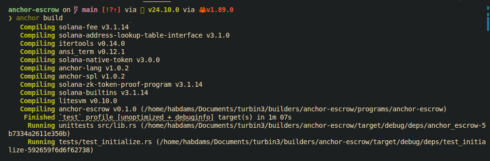
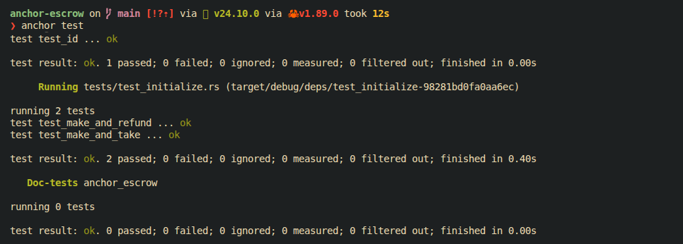

# Anchor Escrow Program

A Solana smart contract built with Anchor that implements a secure token escrow system between two parties. The program enforces trustless exchange of SPL tokens using Program Derived Addresses (PDAs), CPI-based token transfers, and strict account validation.

Testing is done using LiteSVM, enabling fast and deterministic execution without a local validator.

---

## Tech Stack

- Rust (Anchor framework)
- TypeScript (tests)- Solana Web3.js
- SPL Token Program (CPI)
- LiteSVM (testing)

---

## Badges

<p align="left">


</p>

---

## Core Concept

### 1. Initialize Escrow
- Creator defines trade terms (token A ↔ token B)
- Escrow PDA and vault accounts are created

### 2. Deposit
- Initializer deposits Token A into a PDA-controlled vault
- Program enforces ownership + mint validation

### 3. Exchange
- Taker deposits Token B
- Program atomically swaps assets:
  - Vault → Taker
  - Taker → Initializer

### 4. Refund
- If unfulfilled, initializer reclaims funds
- Escrow account is closed safely

---

## Key Features

- PDA-based escrow ownership (no private keys stored)
- Atomic token swaps via CPI
- Strict account validation using Anchor constraints
- Deterministic escrow state transitions
- Safe cancellation path
- Full LiteSVM test coverage (success + failure cases)

---

## Project Structure

```
programs/
  escrow/
    src/
      instructions/
      state/

tests/
  test_initializer.rs
```

---

## Testing

Covered cases:
- Initialization
- Successful exchange
- Refund and Vault close

Run tests:
```bash
anchor test
```

---

## Architecture Summary

- Escrow Account (PDA): stores trade state
- Vault Token Account (PDA-owned): holds tokens
- Initializer: defines and deposits
- Taker: completes swap
- Program: enforces atomic settlement

All transfers use SPL Token CPI with PDA signing.

## Project Build



## Test Sample

